# Self-supervised pre-training for seismic interpretation: which recipe adapts a vision foundation model, and when it pays off

Four self-supervised recipes (I-JEPA, VISReg, DINOv2, MAE), all run as forward functions of the open
[stable-pretraining](https://github.com/rbalestr-lab/stable-pretraining) library, continue the pre-training of a
web-image foundation model (DINOv3 ViT-B/16) on unlabelled sections of one public 3-D seismic survey (Thebe, NW Shelf
Australia). Fault segmentation with 1 to 900 labelled sections is the downstream test, always against a 3-D U-Net trained
from scratch, on one geographically separated split, with three to five seeds per cell. No method here is new; the
contribution is the controlled comparison of pre-training recipes and what it says about when unlabelled seismic data
earns its cost. Web page: **https://ducanhle156.github.io/seismic-pretraining/**.

The story in eleven pictures, in the order the work was done.

## 1. The data: a seismic section, and the faults an expert draws on it

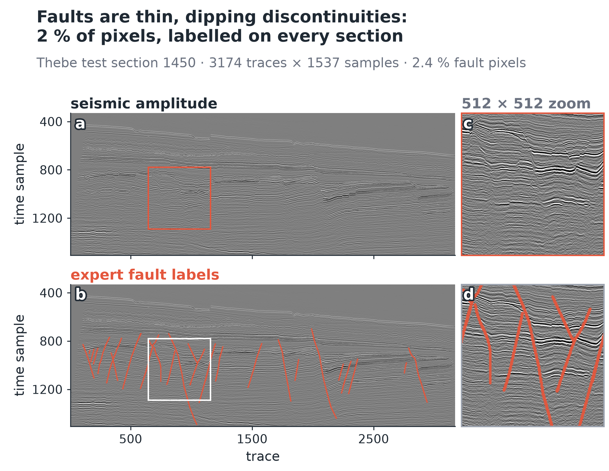

One Thebe section (3174 traces × 1537 samples): amplitude, the expert's fault strokes in red (2.4 % of the pixels), and
the 512² window at which the models work. Faults are thin, tilted breaks that an interpreter still picks by hand;
labelling is the expensive step, so the question is how far unlabelled data can replace labels.

## 2. One survey, cut into slabs that never mix

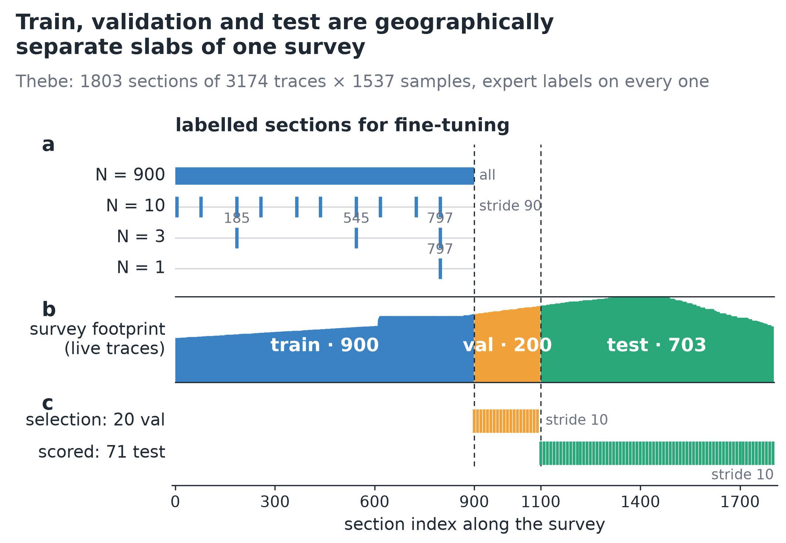

Sections 0–899 train, 900–1099 validation, 1100–1802 test, contiguous along the survey. Pre-training sees the pictures
of the 900 train sections and no labels. Labels are given on 1, 3, 10, 100 or 900 of those same train sections (nested, evenly
spread; at 1 and 3 the choice moves with the seed). Twenty validation sections pick the checkpoint; 71 test sections are
scored once.

## 3. The recipe: foundation model → seismic pre-training → 3-D head

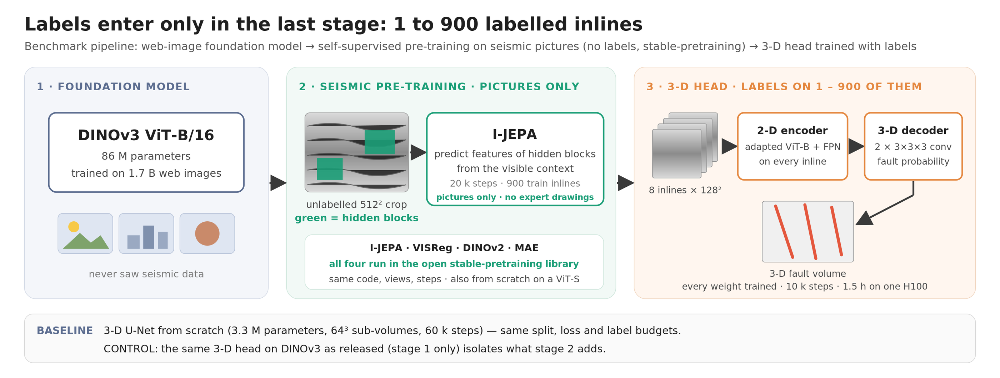

Stage 1 is DINOv3 as released. Stage 2 continues its training on unlabelled seismic crops with one of four recipes, all
forward functions of stable-pretraining (same code, views and step budget). Stage 3 runs the encoder on each section of a
sub-volume and a 3-D decoder turns the features into fault probabilities; it is the only stage that sees labels.
Baseline: a 3-D U-Net from scratch under the same split, loss and label budgets. Control: the same 3-D head on DINOv3
without stage 2.

## 4. Watching pre-training: one recipe quietly breaks the encoder

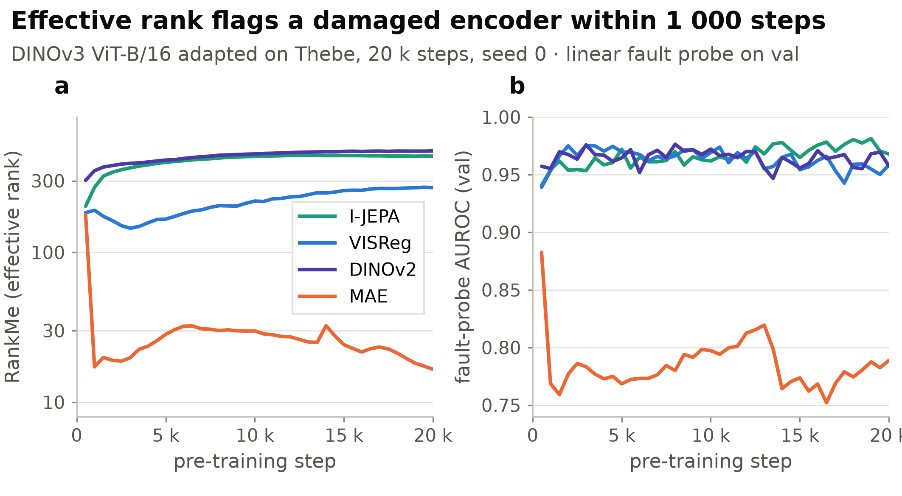

Two label-free signals logged during pre-training. Effective rank of the patch features: MAE collapses from 178 to 17
within a thousand steps, I-JEPA climbs. AUROC of an online linear fault probe on validation sections (detached features,
no gradient to the encoder): MAE drops below 0.8, the other three stay at or above 0.95. Reconstructing pixels forces the
encoder to represent local amplitude texture, exactly what DINOv3 had abstracted away. Effective rank is free: log it and
stop a collapsing run early. It is a gate against collapse, not a ranking tool (it places VISReg too low).

## 5. Which recipe adapts DINOv3 best

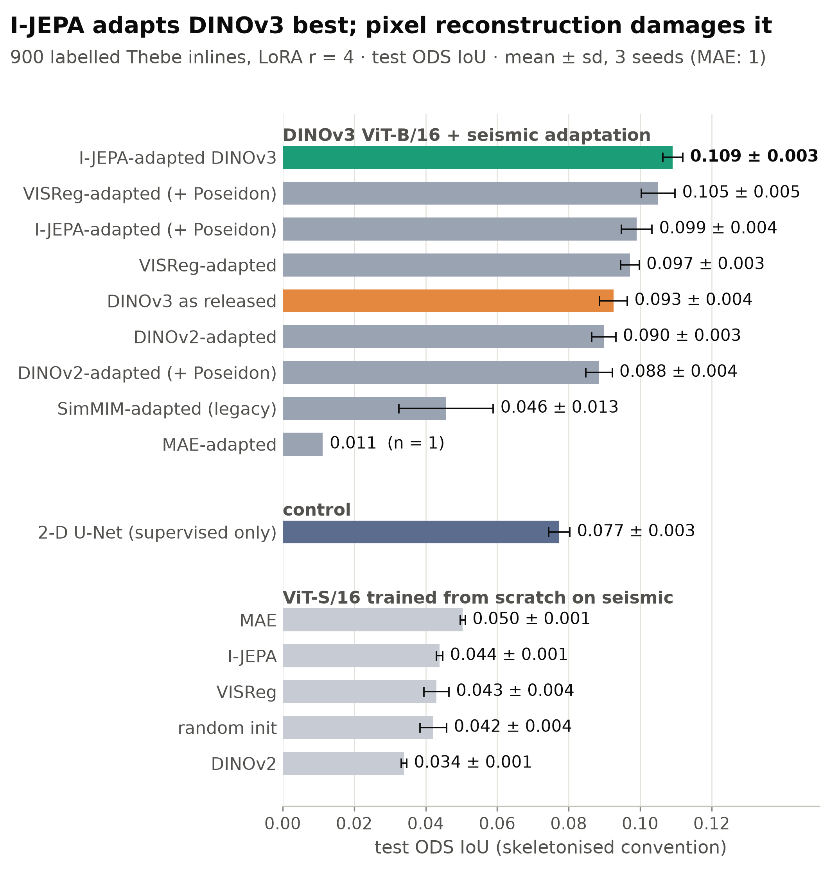

2-D benchmark, 900 labelled sections, LoRA adapter, three seeds: I-JEPA-adapted DINOv3 first (ODS IoU 0.109), then
VISReg (0.097), DINOv3 as released (0.093), DINOv2 (0.090); SimMIM (0.046) and MAE (0.011) fall below no adaptation. The
same recipes from scratch on a ViT-S (0.034–0.050) all trail a plain 2-D U-Net (0.077). Thin-line (skeletonised) scoring,
values ≈ 0.1 by construction; never compared with the 3-D IoU of steps 8–10.

## 6. What the adapted encoder sees

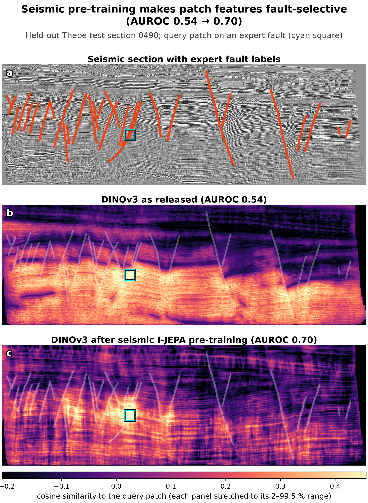

One query patch on a fault (cyan square); every other patch coloured by feature similarity. Released DINOv3 follows
reflector amplitude and depth; after seismic I-JEPA pre-training the other fault traces light up (fault-vs-other AUROC
0.70 vs 0.54). Test sections only. Neither encoder is a fault detector on its own; this is the prior the 3-D head builds on.

## 7. A second survey is not a free win

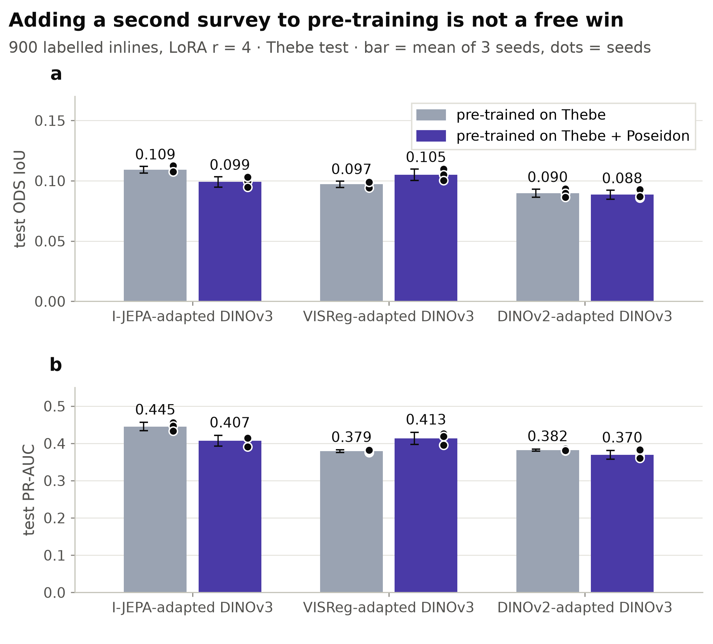

Adding Poseidon (TGS open data, a different basin, AGC-gained, 8-bit) to the corpus: I-JEPA worse (0.109 → 0.099), VISReg
better (0.097 → 0.105), DINOv2 unchanged; no mixed-corpus encoder beats I-JEPA on Thebe alone. Each corpus addition
needs its own validation on the target survey.

## 8. The payoff: how many labelled sections a 3-D fault model needs

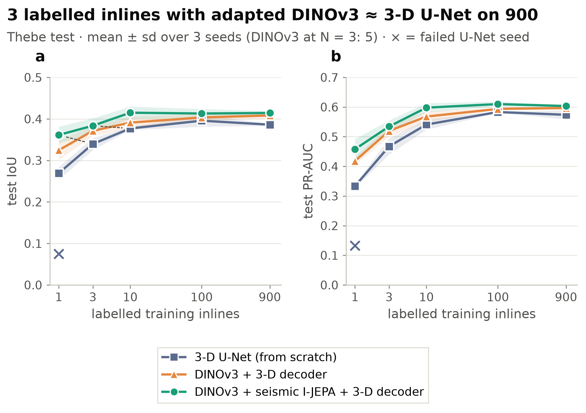

| labelled sections | 3-D U-Net (from scratch) | DINOv3 + 3-D decoder | DINOv3 + seismic I-JEPA + 3-D decoder |
|---:|:---:|:---:|:---:|
| 1 | 0.27 ± 0.02 † | 0.33 ± 0.02 | **0.36 ± 0.02** |
| 3 | 0.34 ± 0.01 | 0.37 ± 0.01 ‡ | **0.38 ± 0.02** ‡ |
| 10 | 0.38 ± 0.00 | 0.39 ± 0.02 | **0.42 ± 0.02** |
| 100 | 0.40 ± 0.01 | 0.40 ± 0.01 | **0.41 ± 0.01** |
| 900 | 0.39 ± 0.00 | 0.41 ± 0.01 | **0.41 ± 0.01** |

Test IoU against the raw expert mask at probability 0.5, mean ± sd over three seeds, 71 held-out sections. † two seeds;
the third U-Net run with one labelled section collapsed (IoU 0.075). ‡ five seeds. Dice, PR-AUC and per-seed values in
[`tables/`](tables/). Absolute IoU near 0.4 is normal for faults drawn as thin lines; never compare it across papers.

**Answer.** Three labelled sections with the pre-trained foundation model reach the accuracy of a 3-D U-Net trained on 100
or on all 900 (0.38 vs 0.40 and 0.39); one labelled section gives a usable volume (0.36) that the U-Net only reaches with
three. The foundation model wins in 14 of 15 seed pairs (the fifteenth, at 100 labels, is a tie at 0.409) and trains in 1.5 h on one H100 against 4 to 10 h for the U-Net (at 30× the
parameters, so the U-Net stays cheaper to run).

## 9. What seismic pre-training itself adds, seed by seed

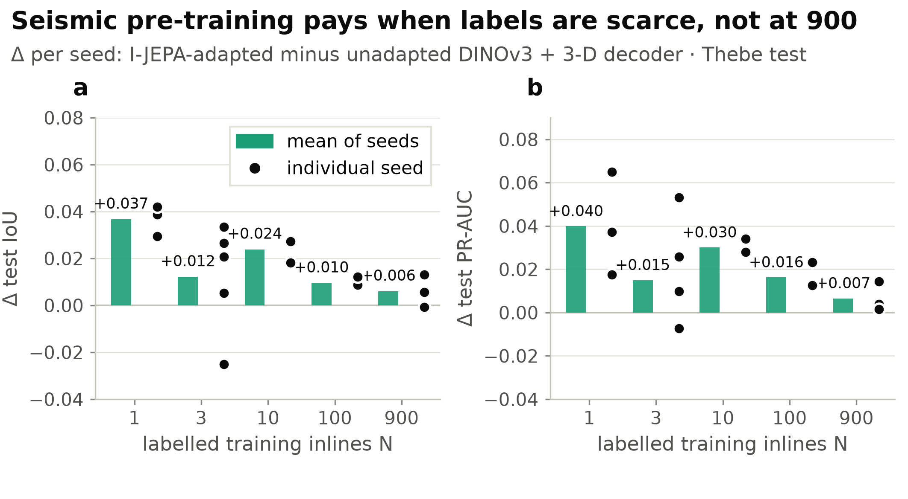

Same labels, same seed, same 3-D head; the only difference is stage 2. Real when labels are scarce: +0.037 IoU with one
labelled section, +0.024 with ten and +0.010 with 100, positive in every seed. With three it is smaller and depends on
which sections are labelled (+0.012, four of five seeds); with 900 labels it is within seed noise (+0.006, two of three seeds). Pre-training pays where labels
cannot do the job; it does not replace them when they are plentiful.

## 10. What it looks like: one test section, 1 / 3 / 10 / 100 / 900 labels

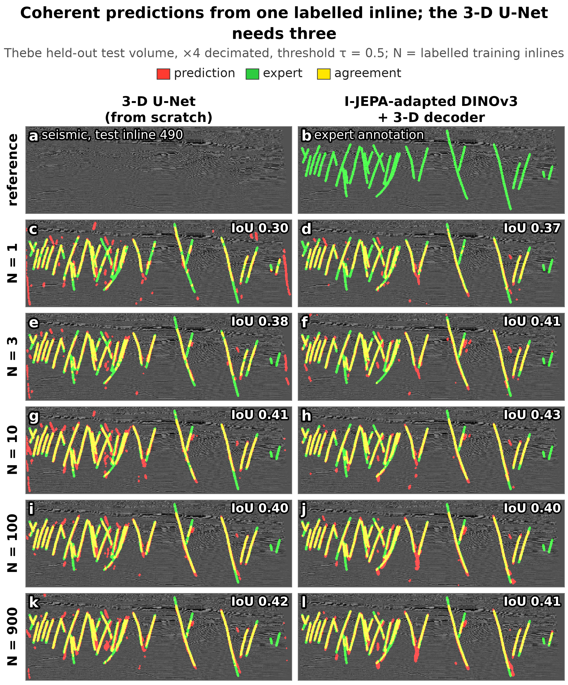

Test section 490 (a median section, not the best). Rows: labelled training sections. Columns: 3-D U-Net vs DINOv3 +
seismic I-JEPA + 3-D decoder. Red = prediction, green = expert, yellow = agreement. Section IoU, U-Net vs pre-trained
model: 0.30 vs 0.37 (1 label), 0.38 vs 0.41 (3), 0.41 vs 0.43 (10), 0.40 vs 0.40 (100), 0.42 vs 0.41 (900).

**Read it as a plateau, not a curve.** The pre-trained model gains from 1 to 3 to 10 labelled sections and nothing after
that (whole test set: 0.36 → 0.38 → 0.42 → 0.41 → 0.41 at 1 / 3 / 10 / 100 / 900); on this section even 3 and 900 look
alike. The U-Net improves up to 100 (0.27 → 0.34 → 0.38 → 0.40) and is flat from there (0.39 at 900), so it meets the
pre-trained model at 3 somewhere between 10 and 100 labelled sections. Both plateaus start between 10 and 100; that
interval itself was not sampled.

## 11. Five findings on one page

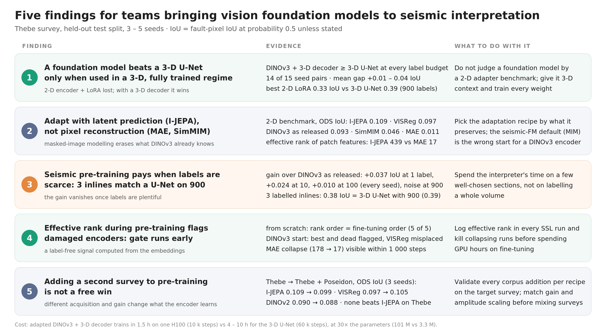

## Limits, stated once

- **One test survey.** The 71 evaluated sections come from Thebe alone, so paired statistics are optimistic and the
  conclusions may not transfer to another basin.
- **Baseline as published, not re-tuned.** The 3-D U-Net runs in the reference paper's regime at every label budget.
- **Not a seismic foundation model.** A public web-image model was adapted; no weights are released here; no recipe is new.
- **Cost.** The foundation model wins on labels and training time, not on inference FLOPs.

## How it was built

- The four pre-training recipes are forward functions of the open
  [stable-pretraining](https://github.com/rbalestr-lab/stable-pretraining) library (rbalestr-lab), used unchanged and kept
  diff-free against upstream; the seismic package around it adds data readers, view pipelines, the 3-D head, the 3-D U-Net
  baseline, evaluation and reporting.
- About 200 PBS jobs on a shared cluster (A10 to H100) driven by a config matrix and a job planner; live registry viewer
  for the pre-training signals; deterministic run ids and checkpoint retention.
- Every figure and table is regenerated by scripts from each run's raw metrics: [`tables/`](tables/).

---

*Seed mean ± sd on the Thebe test split. Data: Thebe (An et al. 2021, CC BY 4.0), Poseidon (TGS open data, CC BY 4.0).
Foundation model: DINOv3 (Meta AI). Pre-training framework: stable-pretraining (rbalestr-lab). Nothing was tuned on the test split.*
